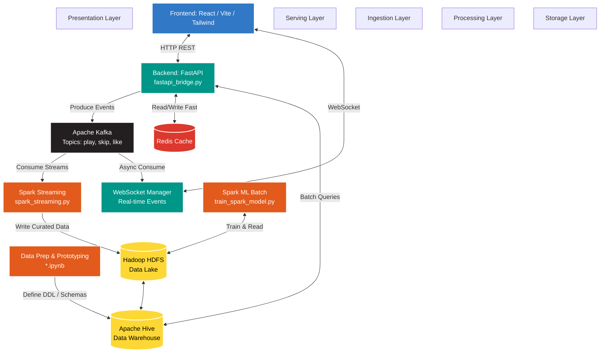

# Project Technical Documentation: "Daylist" Big Data Ecosystem

As a Senior Developer specializing in full-stack Python/React and Big Data engineering, I’ve outlined the architecture, data lifecycle, and operational guide for this project. This system is designed as a robust end-to-end pipeline, moving from raw event ingestion to real-time visualization and machine learning.

---

# 1. System Architecture

The architecture follows a Modern Data Stack pattern, leveraging containerization for environment parity and distributed systems for scalability.

## Architecture Graph (Mermaid)



## Layer Responsibilities

### Ingestion Layer

Apache Kafka acts as the high-throughput distributed messaging backbone, decoupling data producers from consumers.

### Processing Layer (Compute)

#### Spark Streaming (`spark_streaming.py`)

Handles micro-batch processing of Kafka topics, performing real-time transformations and stateful aggregations.

#### Spark ML (`train_spark_model.py`)

Provides distributed model training on historical data stored in the data lake.

### Storage Layer (Persistence)

Hadoop HDFS and Apache Hive serve as the primary data lake and warehouse.

Data is structured into the following zones:

* **Bronze / Raw**: Raw Kafka events.
* **Silver / Curated**: Refined tables defined via SQL logic in the prototyping phase (`*.ipynb`).

### Serving Layer (`fastapi_bridge.py`)

FastAPI provides a high-performance asynchronous REST API that bridges the Hadoop/Spark ecosystem with the frontend application.

Key responsibilities include:

* Utilizing Redis for sub-millisecond caching of ML recommendations.
* Connecting to Hive for batch analytics.
* Orchestrating a WebSocket manager to broadcast Kafka events directly to the frontend.

### Presentation Layer (`frontend/`)

React (TypeScript + Vite) provides a reactive, component-based UI for:

* Data monitoring
* Social interactions
* Music playback simulation
* Real-time dashboards

---

# 2. The Data Lifecycle (Operational Flow)

## 1. Exploration & Prototyping (`*.ipynb` Files)

Development begins in Jupyter Notebooks to define:

* Feature engineering pipelines
* SQL DDL for the `curated_table`
* Data quality validation
* Schema enforcement

This stage validates business logic before production deployment.

## 2. Ingestion & Streaming

When a user clicks **Play** in the React frontend:

1. `fastapi_bridge.py` publishes an event to Kafka.
2. `spark_streaming.py` consumes the stream.
3. Streaming transformations are applied.
4. Processed data is written into Hadoop.

Concurrently:

* A background worker in `fastapi_bridge.py` consumes Kafka messages.
* Events are broadcast through WebSockets.
* The React frontend receives real-time notifications.

## 3. Model Training

`train_spark_model.py` runs batch jobs against curated datasets stored in HDFS to generate predictive models such as:

* Time-of-day playlists
* User recommendations
* Listening behavior predictions

The resulting models are cached in Redis or served through FastAPI.

## 4. API Bridging

FastAPI queries:

* Processed Hive datasets
* Cached ML outputs in Redis

Data is exposed through JSON endpoints such as:

```http
/recommend/{user_id}
/playlist/{user_id}
```

## 5. Frontend Visualization

The React application:

* Fetches data from FastAPI
* Displays analytics dashboards
* Receives real-time updates
* Simulates interactive music streaming workflows

This completes the full end-to-end data lifecycle.

---

# 3. Big Data Characteristics (The 3 Vs)

This project justifies the use of a Big Data stack (Spark, Hadoop, Kafka) over a traditional RDBMS by addressing the three core pillars.

## Volume

By using Hadoop HDFS, the system scales horizontally.

Benefits include:

* Distributed storage across multiple nodes
* Support for terabytes of historical playback logs
* Long-term retention of curated analytical datasets

## Velocity

The combination of Kafka and Spark Streaming enables low-latency processing.

This allows:

* Near real-time ingestion
* Rapid stream processing
* Instant frontend updates through WebSockets

The frontend can reflect state changes almost instantaneously.

## Value (Extraction of Insights)

Raw event logs have low value density.

Using feature engineering and Spark ML, the system transforms noisy streams into structured, analytics-ready datasets such as `curated_table`.

This enables:

* Predictive playlist generation
* Personalized recommendations
* Behavioral analytics
* Strategic product insights

The extraction of business value is the ultimate goal of the Daylist ecosystem.

---

# 4. Developer Tutorial: How to Run the Application

This guide assumes the Big Data cluster is already running through Docker containers for:

* Hadoop
* Kafka
* Redis
* Hive
* Spark

## Step 1: Start the Backend (FastAPI Bridge)

The backend acts as the primary data gateway.

### 1. Navigate to the Project Root

```bash
cd project-root
```

### 2. Install Python Dependencies

It is recommended to use a Python virtual environment.

```bash
pip install fastapi uvicorn pydantic pyhive redis kafka-python
```

> Note: You may need additional system dependencies for `pyhive` and `kafka-python`.

### 3. Start the FastAPI Server

```bash
uvicorn fastapi_bridge:app --host 0.0.0.0 --port 8000 --reload
```

The backend will be available at:

* API Base URL: `http://localhost:8000`
* Swagger Docs: `http://localhost:8000/docs`

---

## Step 2: Start the Frontend (React)

The frontend is built using React, Vite, and TailwindCSS.

### 1. Navigate to the Frontend Directory

```bash
cd frontend
```

### 2. Install Node.js Dependencies

```bash
npm install
```

### 3. Start the Vite Development Server

```bash
npm run dev
```

The frontend will typically run at:

```text
http://localhost:5173
```

---

## Step 3: Using the Application

### 1. Connecting

Open the frontend in your browser.

On startup:

* The frontend connects to the FastAPI backend.
* Initial mock users are fetched from Hive.
* A loading screen displays:

```text
Connecting to Big Data Cluster...
```

### 2. Navigation

Use the left sidebar to navigate between:

* Home
* Search
* Social
* Your Library

### 3. Simulating Streaming (Velocity)

On the **Home** tab:

1. Click a song to play it.
2. The frontend calls the FastAPI `/event/play` endpoint.
3. FastAPI pushes a message into the Kafka `music.events.play` topic.
4. A real-time notification appears in the frontend.

The notification is delivered through:

```text
Kafka → FastAPI WebSocket → React Frontend
```

After approximately 2.5 seconds:

* Recommendations refresh automatically.
* This simulates Spark Streaming processing.
* Updated recommendations are cached in Redis.
* FastAPI retrieves and serves the refreshed data.

### 4. Exploring Insights (Value)

#### Your Library

Select different times of day:

* Morning
* Afternoon
* Night

These views are generated from the `curated_tod_profile` Hive table.

#### Social Tab

The Social section displays aggregated cross-user analytics such as:

* Friend listening history
* Shared trends
* User activity summaries

This data is sourced from the `curated_friend_history` table.
